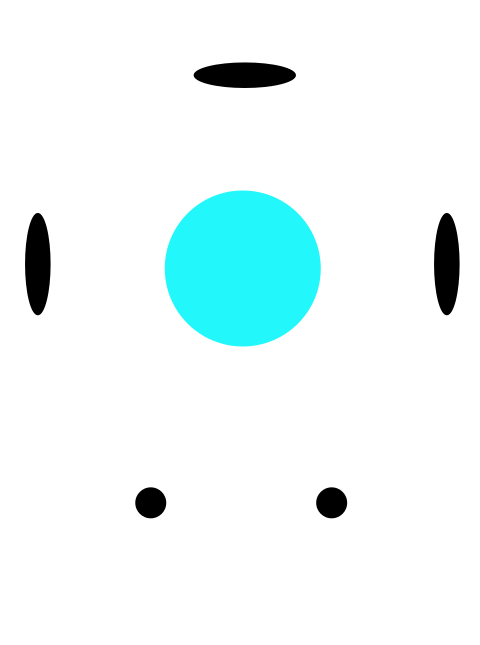

<p align="center">
  
</p>

# Fathom

A lightweight Python alternative to Sonarr + Radarr, built from scratch with LLM-powered media matching.

## What is this?

Fathom combines the functionality of Sonarr (TV) and Radarr (Movies) into a single, lightweight application. Instead of relying on complex regex patterns for release parsing and matching, Fathom uses LLM-based querying to intelligently identify and match media releases.

## Goals

- **Unified** — One tool for both TV shows and movies, not two separate apps
- **Lightweight** — Minimal resource footprint; no heavy .NET/C# runtime
- **Python-native** — Clean, maintainable Python codebase
- **LLM-powered matching** — Replace brittle regex parsing with intelligent language model queries for release name parsing, quality detection, and media matching
- **Full feature parity** — Support the core workflows that make Sonarr/Radarr essential:
  - Library management and monitoring
  - Automatic searching and downloading
  - Quality profile management
  - Jackett / Torznab / Newznab indexer support
  - Download client integration (qBittorrent, Transmission, SABnzbd, etc.)
  - Media renaming and organization
  - Calendar and upcoming releases
  - Notifications (webhooks, Discord, email, etc.)
- **Web UI** — Simple, responsive interface for managing your library
- **API-first** — REST API so other tools can integrate easily

## Stack

- **Language:** Python 3.12+
- **Web framework:** FastAPI
- **Database:** SQLite (async via aiosqlite)
- **LLM integration:** Any OpenAI-compatible API (OpenRouter, local models, LiteLLM, etc.)
- **Frontend:** Jinja2 + HTMX

## Quick Start

```bash
# Clone and install
git clone https://github.com/SteveTheGamemaker/SODAR.git
cd SODAR
pip install -e .

# Copy and edit config
cp config.example.yaml config.yaml

# Run
python -m uvicorn fathom.app:create_app --factory --host 0.0.0.0 --port 8989
```

Or with Docker:

```bash
docker compose up -d
```

Then open http://localhost:8989

## Status

Built entirely via vibe coding with Claude Code.

## License

TBD
